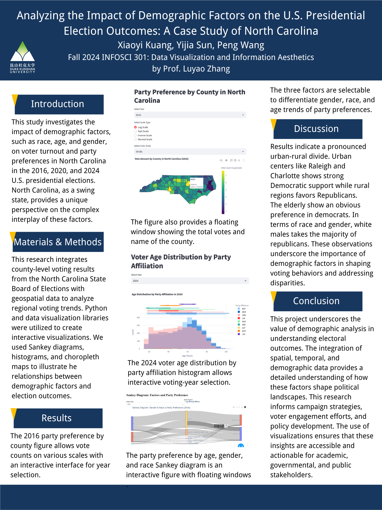

# Analyzing the Impact of Demographic Factors on the U.S. Presidential Election Outcomes: A Case Study of North Carolina

## Authors
- **Peng Wang**: Data Collecting, Data Preprocessing, Visualization Designer
- **Xiaoyi Kuang**: Literature Review, Visualization Designer, Writer
- **Yijia Sun**: 

## Disclaimer
This project is the final submission for **INFOSCI 301: Data Visualization and Information Aesthetics**, instructed by **Prof. Luyao Zhang** at Duke Kunshan University in Autumn 2024.

## Acknowledgments
We extend our gratitude to:
- **Prof. Luyao Zhang** for her invaluable guidance and support.  
- Our **classmates** for their constructive feedback throughout the project.  
- The **AIGC tools** and open-source resources, including Python libraries such as Plotly and Pandas, which enabled efficient data analysis and visualization.  

## Embedded Media

### Demo Video

Explore the interactive graphs developed for our group project, **"Analyzing the Impact of Demographic Factors on the U.S. Presidential Election Outcomes: A Case Study of North Carolina."** The video demonstrates how our visualizations allow users to engage with data dynamically, revealing trends in voting behavior and demographic impacts.

### Poster

## Statement of Intellectual and Professional Growth
This project has been a profound journey of intellectual and professional development. Through exploring complex datasets and designing intuitive visualizations, we gained insights into the intersection of data science and political analysis. We refined our technical skills in Python, enhanced our understanding of demographic influences on elections, and fostered collaboration within an interdisciplinary team.  

By applying advanced visualization techniques like Sankey diagrams and interactive choropleth maps, we bridged the gap between abstract data and meaningful insights. This experience has not only enriched our academic knowledge but also equipped us with the professional tools to tackle real-world data challenges.  

## Table of Contents
- [Introduction](#introduction)  
- [Research Question](#research-question)  
- [Methodology](#methodology)  
- [Data Sources](#data-sources)  
- [Visualizations](#visualizations)  
- [Results](#results)  
- [Navigation Instructions](#navigation-instructions)  
- [Acknowledgments](#acknowledgments)  

## Navigation Instructions
The repository is organized as follows:
- **`/Code`**: Contains Python scripts for data processing, analysis, and visualization.  
- **`/Dataset`**: Includes raw datasets data files used in the analysis.  
- **`/Docs`**: Documentation for dependencies, environment setup, and project workflows.  
- **`/Visualization`**: Outputs of pilot visualizations such as choropleth maps, Sankey diagrams, and time-series graphs.  

### How to Navigate the Repository
- **Code for simulations and visualizations**: Refer to the `/Code` directory for detailed implementations.  
- **Sample datasets**: Available in the `/Dataset` folder, with processed outputs in `/Code/Dataset`.  
- **Documentation**: Setup instructions are provided in `/Docs/`.  
- **Pilot Visualizations**: Explore figures and drafts in `/Visualization`.  

## Research Question
How do demographic factors—such as age, gender, race, education, income, and occupation—impact U.S. election outcomes in North Carolina?

## Methodology
We utilized Python libraries and open-source geospatial tools to integrate and analyze voting and demographic data. Our visualizations were designed to highlight trends in voter behavior, geographic clustering, and demographic impacts.

### Data Sources
1. **North Carolina State Board of Elections (NCSBE)**: County-level voting results.  
2. **NC OneMap Geospatial Data**: Geographic shapefiles of county boundaries.  

## Visualizations
Key visualizations include:  
1. **Choropleth Maps**: Geographic distribution of voting trends.  
2. **Sankey Diagrams**: Proportional relationships between demographic categories and party affiliations.  
3. **Density Plots**: Voter age distribution by party.  

